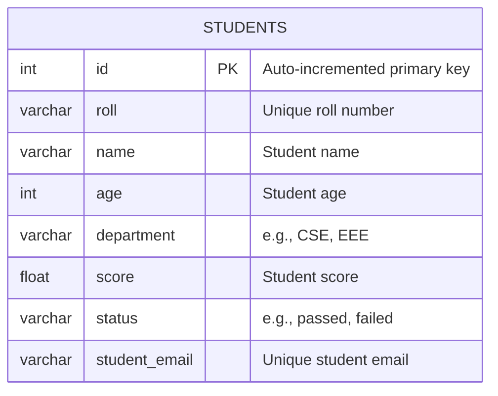

# Students Table Database Tasks

This document outlines the SQL commands executed in PostgreSQL (psql) for table alteration tasks on the `students` table and the creation of a new `courses` table. It includes explanations for each task and Mermaid syntax to visualize the updated `students` table structure.

## Table Structure Overview

The students table initially has the following structure:

| Column Name  | Description                            |
| ------------ | -------------------------------------- |
| `id`         | Auto-incremented primary key           |
| `roll`       | Unique roll number for each student    |
| `name`       | Name of the student                    |
| `age`        | Age of the student                     |
| `department` | Student’s department (e.g., CSE, EEE)  |
| `score`      | Score achieved by the student          |
| `status`     | Academic status (e.g., passed, failed) |
| `last_login` | Last login date                        |

# SQL Commands and Explanations

Below are the SQL commands for the tasks, each followed by an explanation of its purpose.

### 0. Create the Database, Table, and Insert Sample Data

#### Create a new database

```psql
CREATE DATABASE studentdb;
```

- Explanation: This command creates a new PostgreSQL database named `studentdb`.

#### Connect to the new database

```psql
\c studentdb
```

- Explanation: Switches your session to the `studentdb` database.

#### Create the students table

```psql
CREATE TABLE students (
    id SERIAL PRIMARY KEY,
    roll VARCHAR UNIQUE,
    name VARCHAR,
    age INT,
    department VARCHAR,
    score FLOAT,
    status VARCHAR,
    last_login DATE
);
```

- Explanation: This command creates the initial `students` table with the specified columns.

#### Insert sample data into students table

```psql
INSERT INTO students (roll, name, age, department, score, status, last_login) VALUES
('2023001', 'Alice', 20, 'CSE', 85.5, 'passed', '2024-06-01'),
('2023002', 'Bob', 21, 'EEE', 78.0, 'passed', '2024-06-02'),
('2023003', 'Charlie', 22, 'CSE', 65.0, 'failed', '2024-06-03');
```

- Explanation: Inserts three sample student records into the `students` table for testing and demonstration.

### 1. Add a column email (VARCHAR) to the students table

```psql
ALTER TABLE students
ADD email VARCHAR;
```

- Explanation: This command adds a new email column of type `VARCHAR` to the students table. The column is nullable, and existing rows will have `NULL` values in this column. 2. Rename the column `email` to `student_email`

### ALTER TABLE students

```psql
RENAME COLUMN email TO student_email;
```

Explanation: This command renames the email column to `student_email` for clarity or consistency. The data in the column remains unchanged. 3. Add a `UNIQUE` constraint to `student_email`

### ALTER TABLE students

```psql
ADD CONSTRAINT unique_student_email UNIQUE (student_email);
```

Explanation: This command adds a `UNIQUE` constraint named unique_student_email to the `student_email` column, ensuring no duplicate email addresses exist. If duplicates are present, the command will fail until resolved. 4. Create a new table courses with a `PRIMARY KEY`

```psql
CREATE TABLE courses (
course_id SERIAL PRIMARY KEY,
course_name VARCHAR NOT NULL,
department VARCHAR
);
```

- Explanation: This command creates a new courses table with three columns: `course_id` (an auto-incrementing primary key), `course_name` (a required string), and department (an optional string). The `SERIAL` type ensures unique, sequential IDs. 5. Drop the `last_login` column from the students table.

### ALTER TABLE students

```psql
DROP COLUMN last_login;
```

- Explanation: This command permanently removes the `last_login` column from the students table, deleting all associated data. Ensure the column is no longer needed before executing.

### Mermaid Syntax for students Table

The following Mermaid syntax visualizes the students table structure after all alterations (adding `student_email` and dropping `last_login`):



## Using the Commands in psql

### To execute these commands in PostgreSQL:

Connect to your database:

```psql
psql -U <username> -d <database_name>
```

- Run the SQL commands:Copy and paste each SQL command into the psql terminal in the order provided. Ensure the students table exists before running alteration commands.

- Verify the table structure:Check the updated students table structure with:
  `\d students`

### Notes

- The commands assume the students table exists in the database.
- The courses table is created as a new table with a primary key.
- The Mermaid diagram reflects the students table structure after all changes.
- Ensure you have schema modification permissions in psql.
- If adding the UNIQUE constraint fails due to duplicate student*email values, identify duplicates with:SELECT student_email, COUNT(*)

```psql
FROM students
GROUP BY student*email
HAVING COUNT(*) > 1;
```

- Resolve duplicates before reapplying the constraint.
