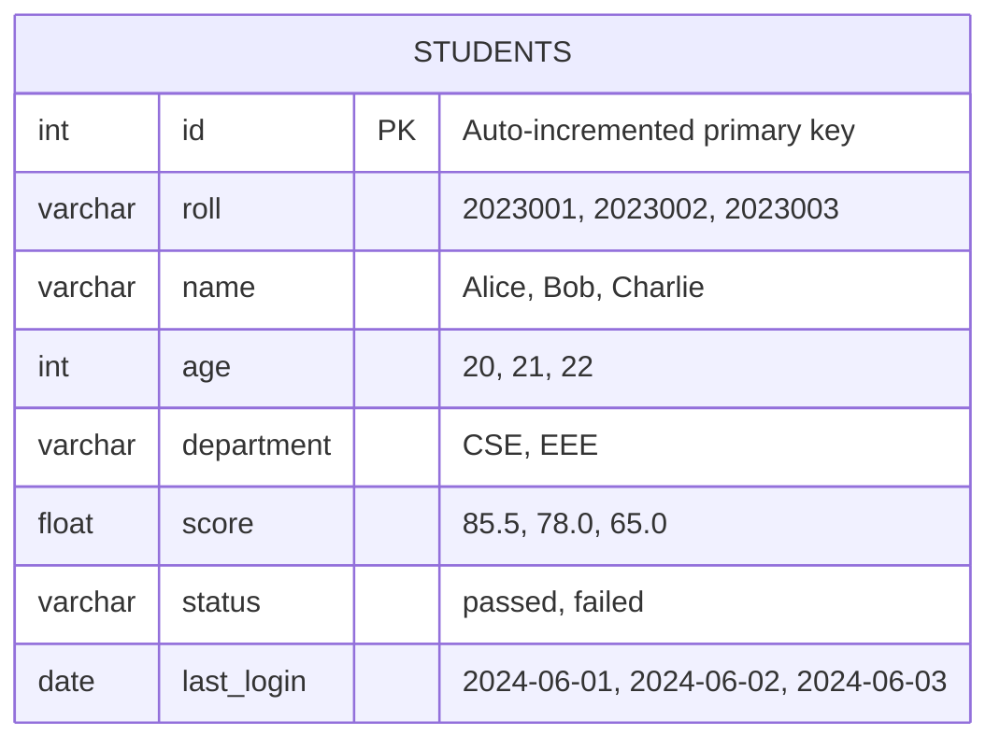
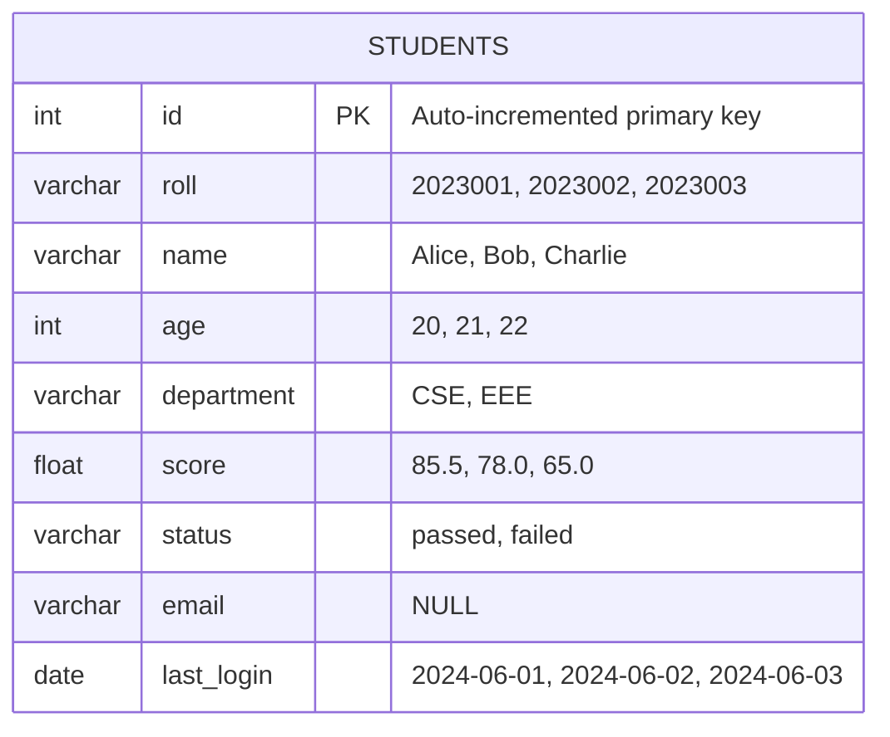
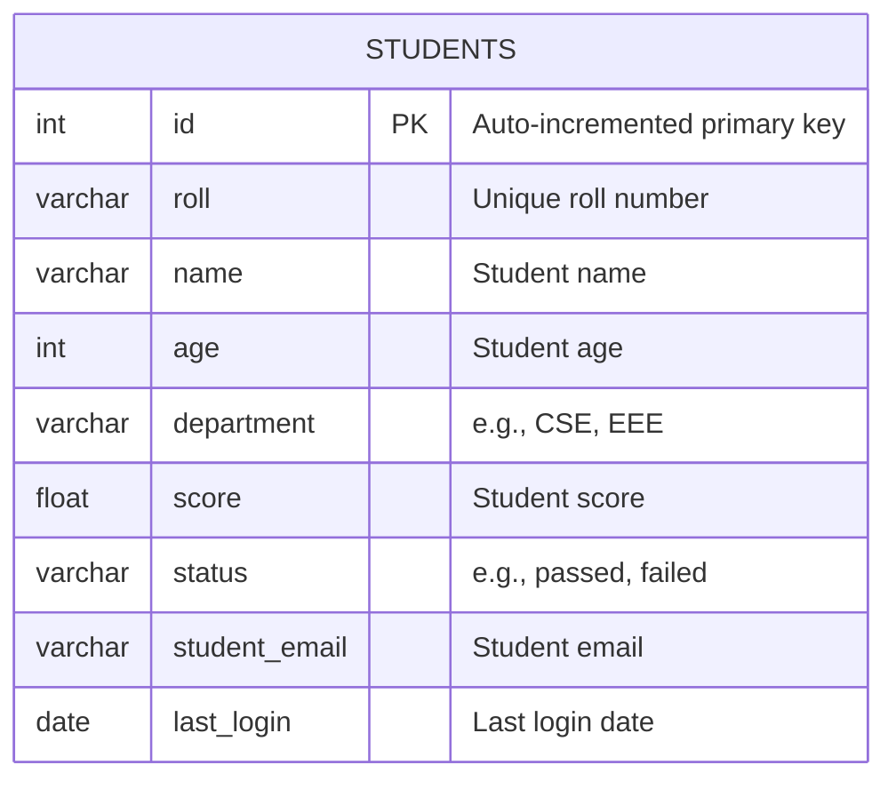
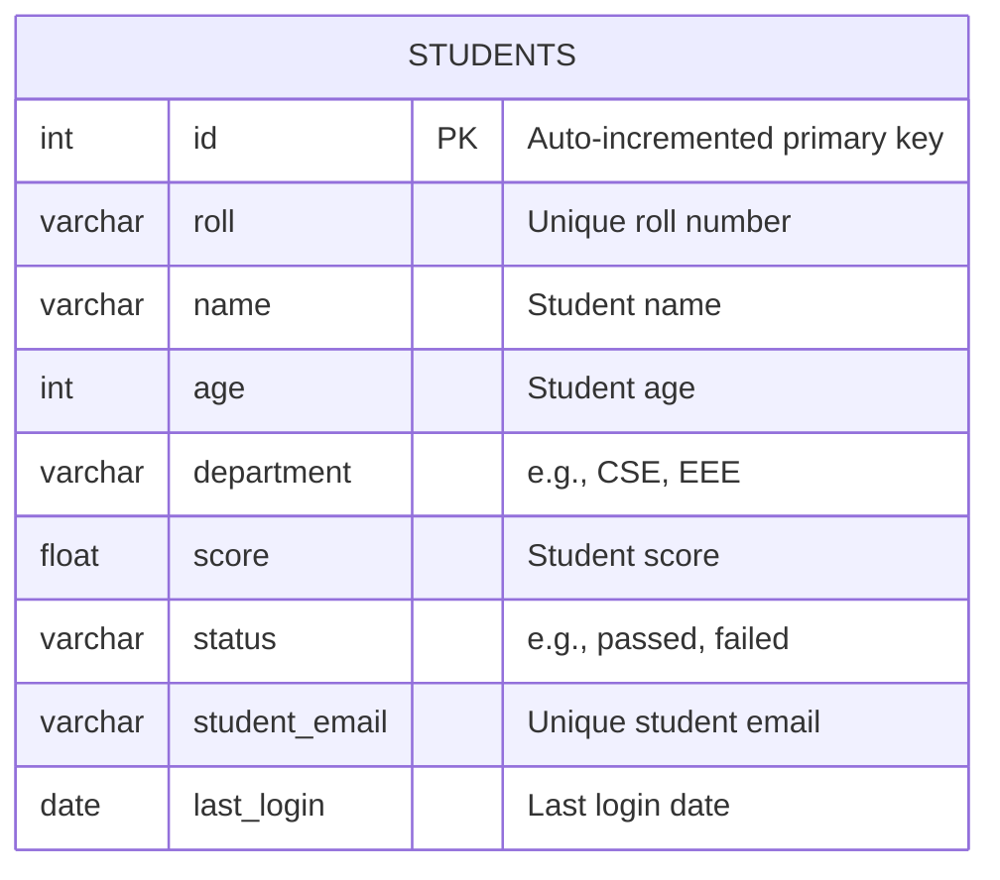
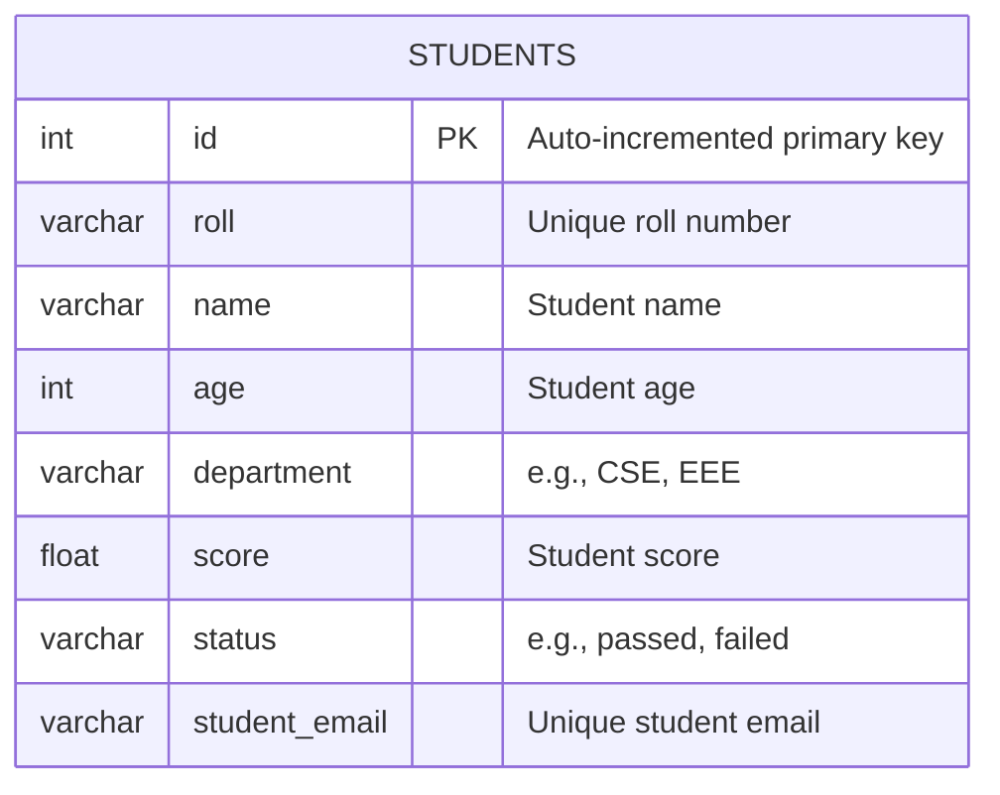

# Students Table Database Tasks

This document outlines the SQL commands executed in PostgreSQL (psql) for table alteration tasks on the `students` table and the creation of a new `courses` table. It includes explanations for each task and Mermaid syntax to visualize the updated `students` table structure.

## Table Structure Overview

The students table initially has the following structure:

| Column Name  | Description                            |
| ------------ | -------------------------------------- |
| `id`         | Auto-incremented primary key           |
| `roll`       | Unique roll number for each student    |
| `name`       | Name of the student                    |
| `age`        | Age of the student                     |
| `department` | Student’s department (e.g., CSE, EEE)  |
| `score`      | Score achieved by the student          |
| `status`     | Academic status (e.g., passed, failed) |
| `last_login` | Last login date                        |

# SQL Commands and Explanations

Below are the SQL commands for the tasks, each followed by an explanation of its purpose.

### 0. Create the Database, Table, and Insert Sample Data

#### Create a new database

```psql
CREATE DATABASE studentdb;
```

- Explanation: This command creates a new PostgreSQL database named `studentdb`.

#### Connect to the new database

```psql
\c studentdb
```

- Explanation: Switches your session to the `studentdb` database.

#### Create the students table

```psql
CREATE TABLE students (
    id SERIAL PRIMARY KEY,
    roll VARCHAR UNIQUE,
    name VARCHAR,
    age INT,
    department VARCHAR,
    score FLOAT,
    status VARCHAR,
    last_login DATE
);
```

- Explanation: This command creates the initial `students` table with the specified columns.

#### Insert sample data into students table

```psql
INSERT INTO students (roll, name, age, department, score, status, last_login) VALUES
('2023001', 'Alice', 20, 'CSE', 85.5, 'passed', '2024-06-01'),
('2023002', 'Bob', 21, 'EEE', 78.0, 'passed', '2024-06-02'),
('2023003', 'Charlie', 22, 'CSE', 65.0, 'failed', '2024-06-03');
```

- Explanation: Inserts three sample student records into the `students` table for testing and demonstration.

#### Mermaid Table Visualization (After Insert)



#### Data Table Visualization (After Insert)

| id  | roll    | name    | age | department | score | status | last_login |
| --- | ------- | ------- | --- | ---------- | ----- | ------ | ---------- |
| 1   | 2023001 | Alice   | 20  | CSE        | 85.5  | passed | 2024-06-01 |
| 2   | 2023002 | Bob     | 21  | EEE        | 78.0  | passed | 2024-06-02 |
| 3   | 2023003 | Charlie | 22  | CSE        | 65.0  | failed | 2024-06-03 |

### 1. Add a column email (VARCHAR) to the students table

```psql
ALTER TABLE students
ADD email VARCHAR;
```

- Explanation: This command adds a new email column of type `VARCHAR` to the students table. The column is nullable, and existing rows will have `NULL` values in this column.

#### Mermaid Table Visualization (After Adding `email` Column)



#### Data Table Visualization (After Adding `email` Column)

| id  | roll    | name    | age | department | score | status | email | last_login |
| --- | ------- | ------- | --- | ---------- | ----- | ------ | ----- | ---------- |
| 1   | 2023001 | Alice   | 20  | CSE        | 85.5  | passed | NULL  | 2024-06-01 |
| 2   | 2023002 | Bob     | 21  | EEE        | 78.0  | passed | NULL  | 2024-06-02 |
| 3   | 2023003 | Charlie | 22  | CSE        | 65.0  | failed | NULL  | 2024-06-03 |

### ALTER TABLE students

```psql
RENAME COLUMN email TO student_email;
```

Explanation: This command renames the email column to `student_email` for clarity or consistency. The data in the column remains unchanged.

#### Mermaid Table Visualization (After Renaming `email` to `student_email`)



#### Data Table Visualization (After Renaming `email` to `student_email`)

| id  | roll    | name    | age | department | score | status | student_email | last_login |
| --- | ------- | ------- | --- | ---------- | ----- | ------ | ------------- | ---------- |
| 1   | 2023001 | Alice   | 20  | CSE        | 85.5  | passed | NULL          | 2024-06-01 |
| 2   | 2023002 | Bob     | 21  | EEE        | 78.0  | passed | NULL          | 2024-06-02 |
| 3   | 2023003 | Charlie | 22  | CSE        | 65.0  | failed | NULL          | 2024-06-03 |

### ALTER TABLE students

```psql
ADD CONSTRAINT unique_student_email UNIQUE (student_email);
```

Explanation: This command adds a `UNIQUE` constraint named `unique_student_email` to the `student_email` column, ensuring no duplicate email addresses exist. If duplicates are present, the command will fail until resolved.

#### Mermaid Table Visualization (After Adding UNIQUE Constraint to `student_email`)



#### Data Table Visualization (After Adding UNIQUE Constraint to `student_email`)

| id  | roll    | name    | age | department | score | status | student_email | last_login |
| --- | ------- | ------- | --- | ---------- | ----- | ------ | ------------- | ---------- |
| 1   | 2023001 | Alice   | 20  | CSE        | 85.5  | passed | NULL          | 2024-06-01 |
| 2   | 2023002 | Bob     | 21  | EEE        | 78.0  | passed | NULL          | 2024-06-02 |
| 3   | 2023003 | Charlie | 22  | CSE        | 65.0  | failed | NULL          | 2024-06-03 |

#### Data Table Visualization (After Creating `courses` Table)

| course_id | course_name | department |
| --------- | ----------- | ---------- |
|           |             |            |

_No data has been inserted yet. The table is ready to accept new course records._

#### Data Table Visualization (After Dropping `last_login` Column)

| id  | roll    | name    | age | department | score | status | student_email |
| --- | ------- | ------- | --- | ---------- | ----- | ------ | ------------- |
| 1   | 2023001 | Alice   | 20  | CSE        | 85.5  | passed | NULL          |
| 2   | 2023002 | Bob     | 21  | EEE        | 78.0  | passed | NULL          |
| 3   | 2023003 | Charlie | 22  | CSE        | 65.0  | failed | NULL          |

### Mermaid Syntax for students Table

The following Mermaid syntax visualizes the students table structure after all alterations (adding `student_email` and dropping `last_login`):



## Using the Commands in psql

### To execute these commands in PostgreSQL:

Connect to your database:

```psql
psql -U <username> -d <database_name>
```

- Run the SQL commands:Copy and paste each SQL command into the psql terminal in the order provided. Ensure the students table exists before running alteration commands.

- Verify the table structure:Check the updated students table structure with:
  `\d students`

### Notes

- The commands assume the students table exists in the database.
- The courses table is created as a new table with a primary key.
- The Mermaid diagram reflects the students table structure after all changes.
- Ensure you have schema modification permissions in psql.
- If adding the UNIQUE constraint fails due to duplicate student*email values, identify duplicates with:SELECT student_email, COUNT(*)
- Resolve duplicates before reapplying the constraint.

## Filtering & Logical Operations

### 1. Find all students who have a score greater than 80 and not null

```psql
SELECT * FROM students
WHERE score > 80 AND score IS NOT NULL;
```

### 2. Exclude students from a specific department using NOT

```psql
SELECT * FROM students
WHERE department NOT IN ('EEE');
```

_Replace `'EEE'` with the department you want to exclude._

### 3. Fetch students whose names start with 'A' using LIKE and ILIKE

```psql
-- Case-sensitive
SELECT * FROM students
WHERE name LIKE 'A%';

-- Case-insensitive
SELECT * FROM students
WHERE name ILIKE 'A%';
```

### 4. Select all students whose age is between 18 and 25

```psql
SELECT * FROM students
WHERE age BETWEEN 18 AND 25;
```

### 5. Retrieve rows using IN for a specific set of roll numbers

```psql
SELECT * FROM students
WHERE roll IN ('2023001', '2023003');
```

_Replace the roll numbers as needed._

---

## Aggregate Functions

### 1. Count how many students exist in the students table

```psql
SELECT COUNT(*) FROM students;
```

### 2. Find the average score of students in a specific department

```psql
SELECT AVG(score) FROM students
WHERE department = 'CSE';
```

_Replace `'CSE'` with your department._

### 3. Get the maximum and minimum age of all students

```psql
SELECT MAX(age) AS max_age, MIN(age) AS min_age FROM students;
```

---

## Update & Delete Operations

### 1. Update the status of students who scored less than 50 to 'failed'

```psql
UPDATE students
SET status = 'failed'
WHERE score < 50;
```

### 2. Delete students who have not logged in since last year

```psql
DELETE FROM students
WHERE last_login < (CURRENT_DATE - INTERVAL '1 year');
```

### 3. Use LIMIT and OFFSET to fetch the second page of results (5 per page)

```psql
SELECT * FROM students
ORDER BY id
LIMIT 5 OFFSET 5;
```
